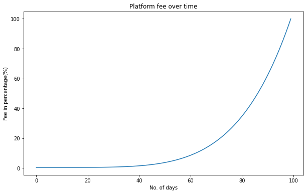
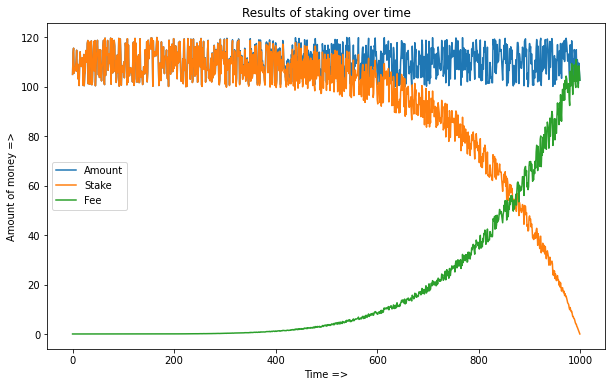

# Improvised Decentralized prediction market smart contracts
## Introduction
[Forecast](https://futureforecast.netlify.app/) is a decentralized market where users can stake on a question and get exciting and high returns. We can provide you more returns with the help of external network staking clients. What are you waiting for? Lets stake some Matic with minimal gas fee!🥳

### Type of users
 - An owner:
   - can post a new question
   - can set start time & end time
   - will get the rewards at the end
 - A user:
   - can stake on an option
     - Pay some validation+platform fee, which increases as we reach closer to the end time
     - Can change their option at any time
     - Get reward after resolution phase
   - can change their option by paying a small amount of fee
 - Validators:
   - Can validate on an option
   - Get rewards if their option turns out to be correct

### Features
 - Right users will always get profit
 - Right validators will always get profit
 - Owner will get their benefit
 - Contract states: Betting, inactive, reporting, resolved
 - External staking through smart contract, ps: more profit to everyone
 - Deployment on matic
 - Compatible with metamask and portis

## Platform fee for stakers over time
The platform fee increases with degree 5 polynomial function as the number of days increases, explained by the given formula `y = k*x^5`, where `x` is the number of days and `k` is a normalizing constant. 

## Rewards vs. stake over time

## Technology used:
 - Smart contract: 
   - [Solidity v0.7.6](https://docs.soliditylang.org/en/v0.7.6/index.html)
   - [EIP1167 Proxy contract](https://eips.ethereum.org/EIPS/eip-1167)
   - [OpenZeppelin](https://openzeppelin.com/)

## Files
    .
    ├── contracts
    │   ├── Factory
    │   │   └── EIP1167_Factory.sol
    │   ├── Question
    │   │   └── EIP1167_Question.sol
    │   └── Utils
    │       ├── CloneFactory.sol
    │       ├── console.sol
    │       ├── Formulas.sol
    │       └── SafeMath.sol
    ├── hardhat.config.js
    ├── helper
    │   ├── components-ganache.js
    │   └── components-hre.js
    ├── integ
    │   └── info.json
    ├── migrations
    │   ├── 1_local_node.js
    │   └── 2_any.js
    ├── package.json
    ├── README.md
    └── test
        ├── 1_EIP1167_Tests.js
        ├── 2_Require_Tests.js
        └── 3_Random_market_Simulation.js

## How to run?
 - `npm i`: Installation
 - `npm run compile`: Compile the contracts
 - `npm run test`: Run the tests
 - `npm run node`: Run the local hardhat node
 - `npm run hh`: Deploy on local hardhat node
 - `npm run any`: Deploy on custom specified network

## VS Code Extensions
 - [Solidity by Juan Blanco](https://marketplace.visualstudio.com/items?itemName=JuanBlanco.solidity): error messages in the editor
 - [Prettier - Code Formatter](https://marketplace.visualstudio.com/items?itemName=esbenp.prettier-vscode): formatting js files

## Contributors
<table>
  <tr>
    <td align="center">
      <a href="https://github.com/akcgjc007">
          
           
          <b>Anupam Kumar</b>
      </a>
    </td>
    <td align="center">
      <a href="https://github.com/rashtrakoff">
          
           
          <b>Chinmay Sai Vemuri</b>
      </a>
    </td>
    <td align="center">
      <a href="https://github.com/sksuryan">
          
           
          <b>Saurabh Kumar Suryan</b>
      </a>
    </td>
    <td align="center">
      <a href="https://github.com/CapTen101">
          
           
          <b>Tushar Rohilla</b>
      </a>
    </td>
    <td align="center">
      <a href="https://github.com/VipinVIP">
          
           
          <b>VIPIN K P</b>
      </a>
    </td>
  </tr>
</table>

